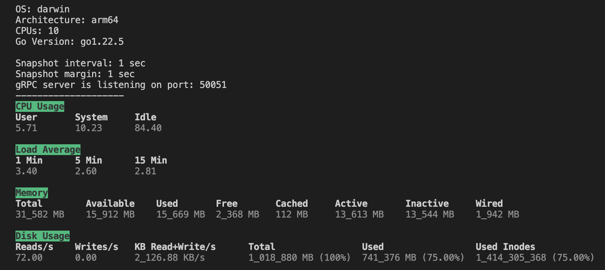

# sysmon

Daemon program to collect information about the system is running on and sends it to its clients in GRPC.

## Supported platforms

- OS X (tested with 14.6.1)
- Ubuntu (tested with 18.04, 23.10)

## Getting started

- Clone the repo
- Install the dependencies

```sh
make install-deps 
```

- Build the app

```sh
# Creates the binary bin/sysmon
make build
```

### Docker

You can try the app using the docker image with Ubuntu 18.04 to check how it works.
For more docker configuration check `docker-compose.yaml`.

```sh
# Runs the sysmon service in a docker container with the ubuntu1804 image 
# and attach to the container in interactive mode
make docker
```

## Usage

- `-n` - interval of time to output the metrics
- `-m` - margin of time between statistics output
- `-grpc-port` - gRPC port to run the gRPC-server to get metrics by API
- `--config` - path to the configuration yaml-file that stores all app settings

Configuration example

```yaml
# Interval of time to output the metrics
interval: 1
# Margin of time between statistics output
margin: 2
# Port to listen for gRPC requests
grpcPort: 50051
exclude:
  metrics:
    # List of metrics to exclude from the output
    - cpu
    - memory
    - loadavg
    - disk
```

> NOTICE that config values replace flag values

```sh
# Runs the app with yaml configuration file
bin/sysmon --confifg=path/to/sysmon.yml
```

```sh
# Runs the app with manul provided flags
bin/sysmon -n=5 -m=15 -grpc-port=50051
```

```sh
# Runs the app with only default configuration
bin/sysmon
```

### Example



> NOTICE that **Disk Usage** shows the metrics for all disks mounted.

## API

There is a gRPC API to get the app results stored in `tmp/`

### GetStats

Returns the system monitoring statistics resulted with the app.

#### Response example

```json
{
    "cpu": {
        "user": 7.48,
        "system": 11.2,
        "idle": 81.49
    },
    "disk": {
        "reads": 34,
        "writes": 0,
        "readWriteKb": 349.85999999999996,
        "totalMb": "1018880",
        "usedMb": "745472",
        "usedPercent": 76,
        "usedInodes": "1422283552",
        "usedInodesPercent": 76
    },
    "memory": {
        "totalMb": "19626",
        "availableMb": "8427",
        "freeMb": "154",
        "activeMb": "8330",
        "inactiveMb": "8272",
        "WiredMb": "2817"
    },
    "loadAverage": {
        "oneMin": 2.46,
        "fiveMin": 2.97,
        "fifteenMin": 3.13
    }
}
```
